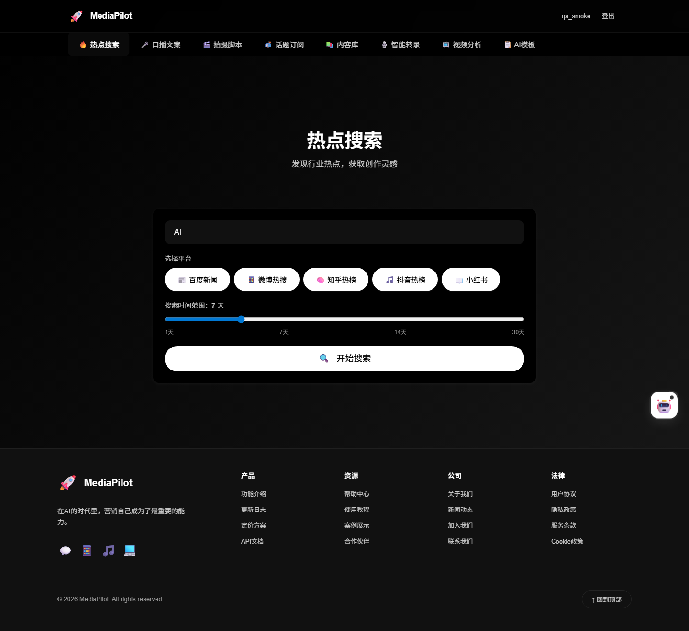
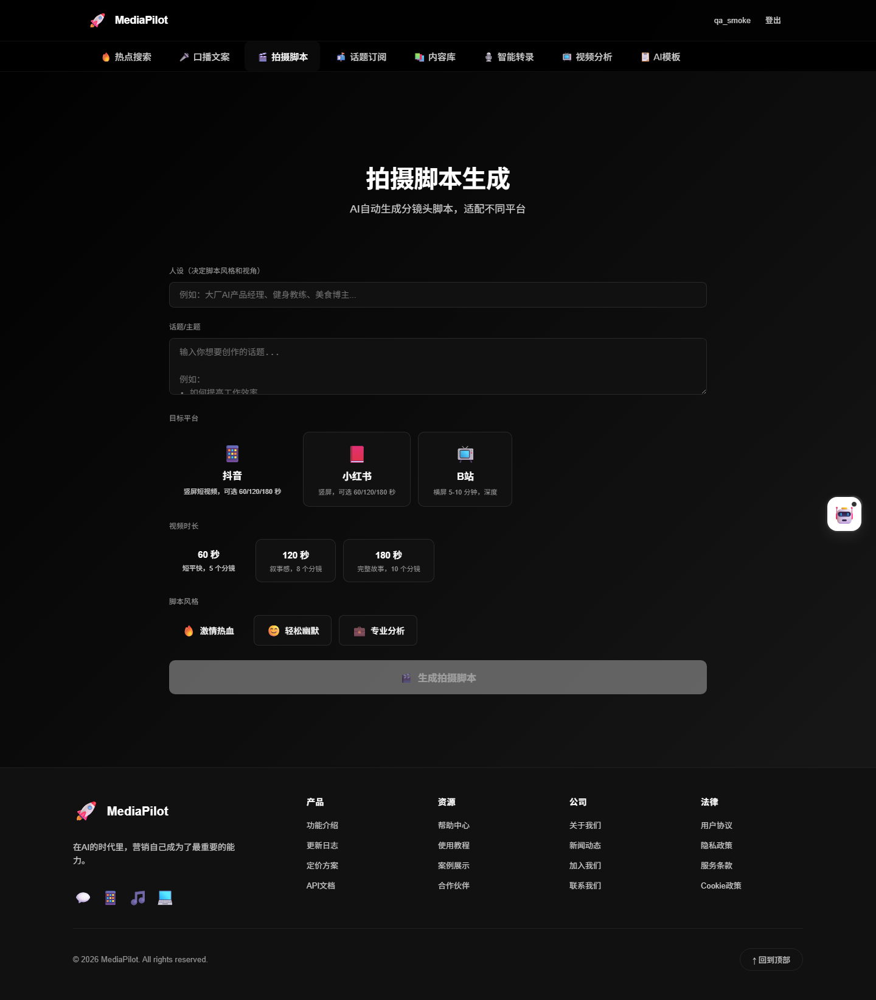
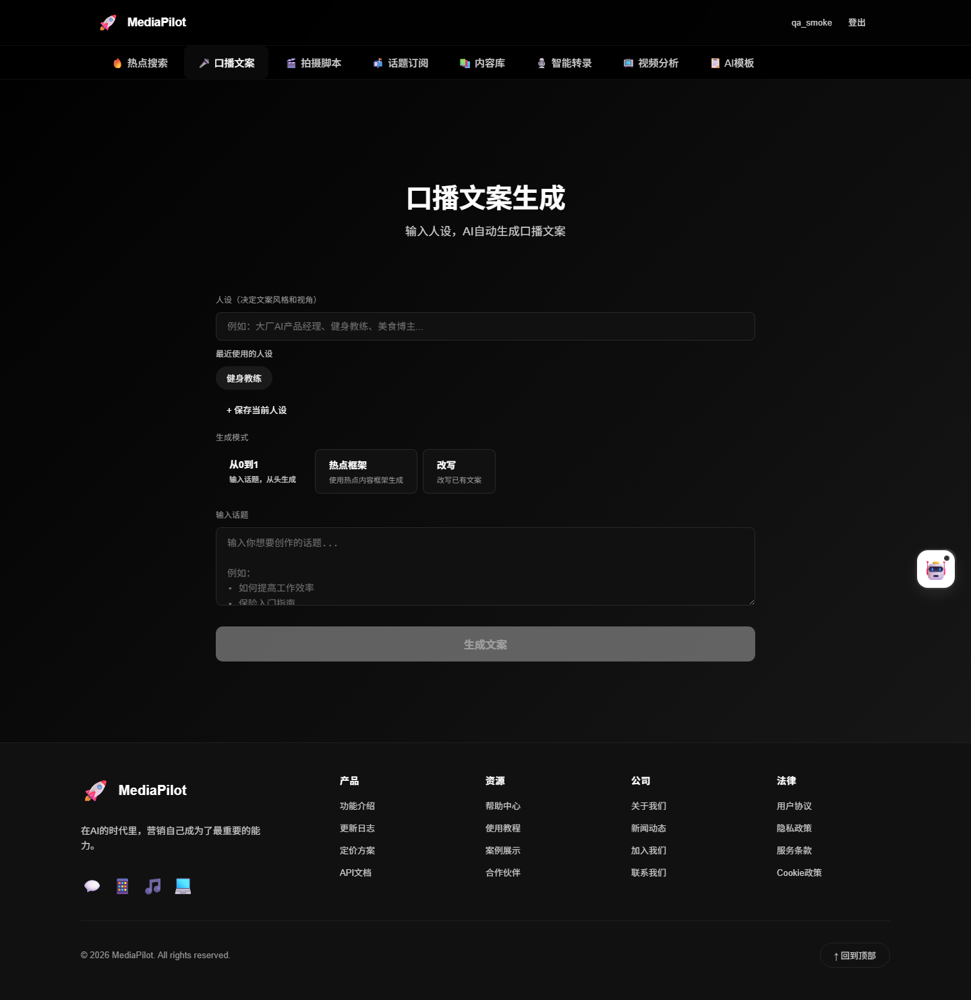
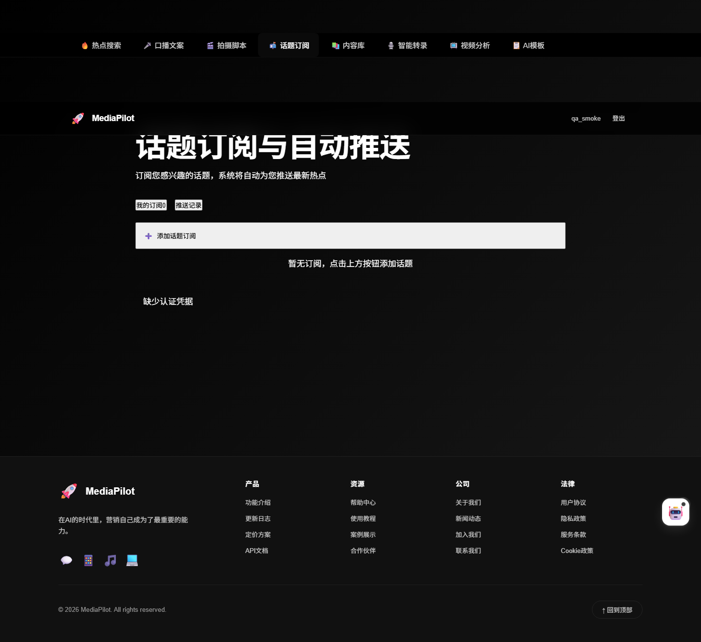
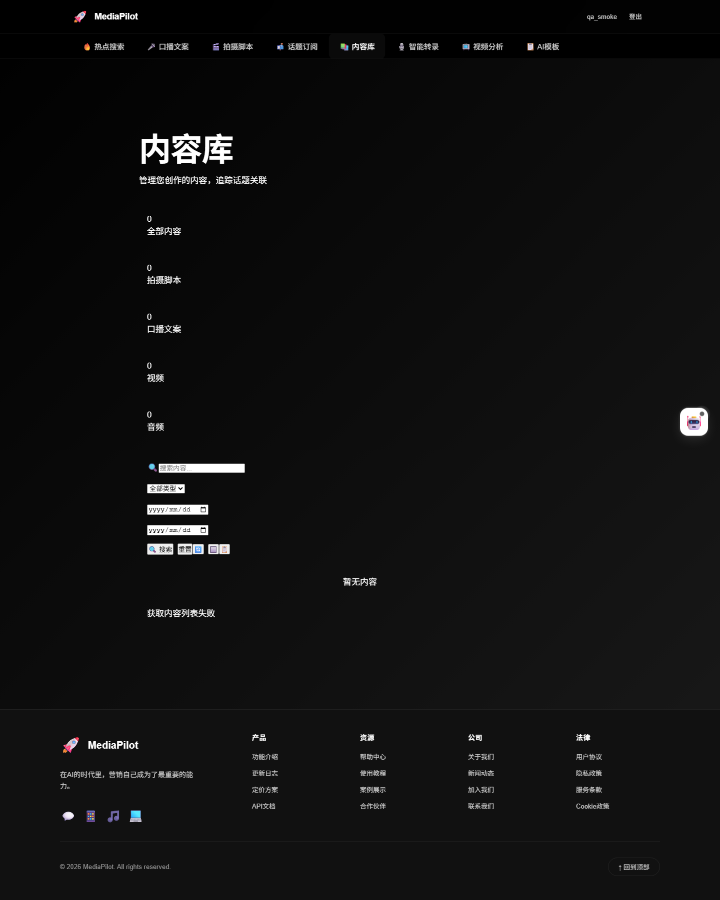
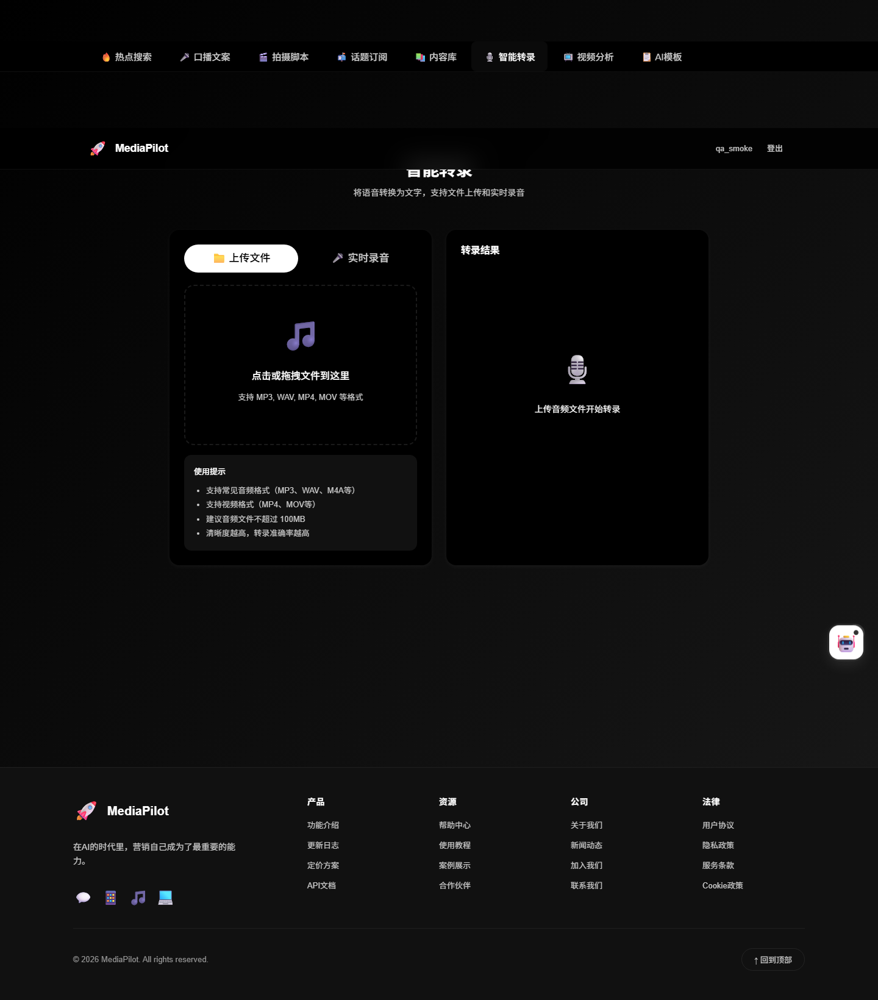
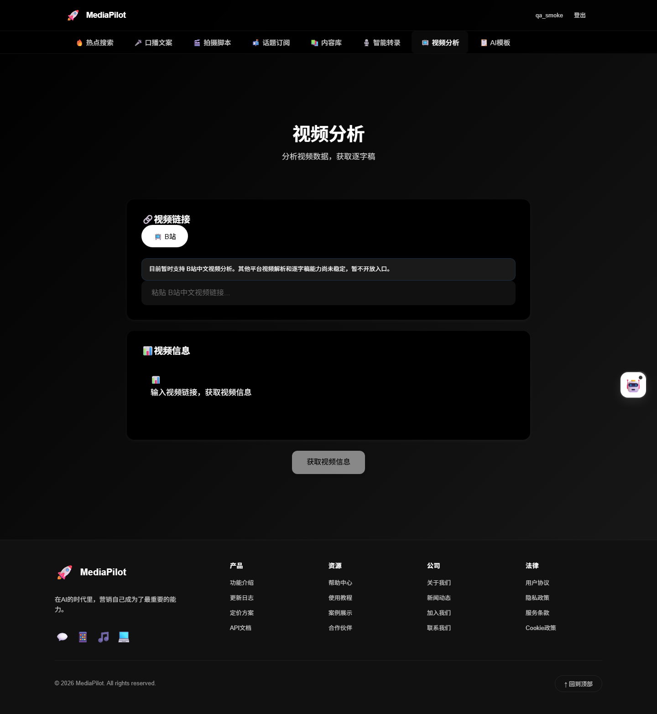

# MediaPilot

> 在 AI 时代，把自己营销出去是最重要的能力。

新媒体人一站式提效工具——从发现热点到创作内容，全流程自动化。

```
发现热点 → 生成文案/脚本 → 制作视频 → 发布内容
```

---

## 这是什么

MediaPilot 把新媒体人的日常链路串成一条流水线：搜全网热点、订阅话题自动推送、一键生成口播文案和拍摄脚本、音视频转写、视频分析。所有产出自动入库、可追溯、可复盘。

不是"又一个 AI 写作工具"——它解决的是**链路断裂**问题：热点、文案、脚本、素材散落在不同工具里，互相不通。MediaPilot 用「热点」这条主线把它们串起来。

---

## 核心功能

| 模块 | 能力 | 截图 |
|------|------|------|
| 🔥 全网热点搜索 | 百度/微博/知乎/抖音/小红书五端聚合，AI 总结，`is_today` 今日徽章 |  |
| 🎬 拍摄脚本生成 | 三平台（抖音/小红书/B站）× 三风格矩阵，分镜头脚本 + 导出 |  |
| 🎤 口播文案生成 | 从0到1 / 热点框架 / 改写三模式，人设系统，"再改改" |  |
| 📬 话题订阅推送 | 订阅话题，每日 08:00 自动扫描新热点推送 |  |
| 📚 内容关联追踪 | 文案/脚本自动入库，热点反查，话题趋势曲线 |  |
| 🎙️ 音视频转写 | Whisper 本地转写，时间轴 + 大纲，支持音频/视频 |  |
| 📺 视频分析 | B站中文视频解析，逐字稿提取（暂仅支持B站中文） |  |
| 🤖 AI 产品导师 | 知道产品每个功能怎么用，关键词命中 + LLM 兜底 |  |

---

## 技术栈

| 层 | 技术 |
|---|------|
| 前端 | React 19 + Vite + Tailwind CSS |
| 后端 | FastAPI + SQLAlchemy + Pydantic v2 + Alembic |
| AI | 火山引擎 Ark API（agnes-2.0-flash） |
| 转写 | Whisper 本地推理 |
| 队列 | Redis + ARQ（异步任务） |
| 调度 | APScheduler（订阅推送 + Token 清理） |
| 数据库 | SQLite（开发）/ PostgreSQL（生产） |
| 认证 | JWT（access + refresh） |

---

## 快速开始

### 环境要求

- Node.js ≥ 18
- Python ≥ 3.11
- Redis（Docker 即可）
- FFmpeg（视频转写需要）

### 后端

```bash
cd backend
python -m venv .venv && source .venv/bin/activate  # Windows: .venv\Scripts\activate
pip install -r requirements.txt

# 配置环境变量
cp ../.env.example ../.env
# 编辑 .env 填入 AI_API_KEY / AI_BASE_URL / AI_MODEL

# 数据库迁移
cd .. && alembic upgrade head

# 启动 API（端口 8000）
python -m uvicorn backend.main:app --port 8000

# 另开终端启动 Worker
arq backend.worker.Worker
```

### 前端

```bash
cd web
npm install
npm run dev  # http://localhost:5173
```

### Redis

```bash
docker run -d --name mediapilot-redis -p 6379:6379 redis:7-alpine
```

---

## 项目结构

```
MediaPilot/
├── backend/                # FastAPI 后端
│   ├── api/                # 路由层（auth/trending/copywriting/media/...）
│   ├── services/           # 业务逻辑
│   ├── core/               # AI 服务、转写引擎、平台 API
│   ├── models/             # 数据模型 + Pydantic schemas
│   ├── scrapers/           # 各平台爬虫
│   ├── repositories/       # 数据访问层
│   ├── tests/              # e2e + unit 测试
│   └── worker.py           # ARQ Worker 入口
├── web/                    # React 前端
│   ├── src/
│   │   ├── pages/          # 页面组件
│   │   ├── components/     # UI 组件
│   │   ├── services/       # API 封装
│   │   ├── hooks/          # 业务 hooks
│   │   ├── contexts/       # 状态管理
│   │   └── routes/         # 路由配置
│   └── vite.config.ts
├── docs/                   # 产品文档
│   ├── PRD.md              # 产品需求文档
│   ├── CHANGELOG.md        # 更新日志
│   └── screenshots/        # 产品截图
└── .env.example            # 环境变量模板
```

---

## 路线图

### Phase 1（已完成）
- ✅ 全网热点搜索
- ✅ 话题订阅与自动推送
- ✅ 口播文案生成优化
- ✅ 拍摄脚本生成
- ✅ 内容关联与追踪

### Phase 2（进行中）
- ✅ 音视频转写
- ✅ 视频分析（B站中文）
- ⬜ 数字人视频生成
- ⬜ 视频剪辑

### v3 工程化（已完成）
- ✅ 企业级重构：异步体系 + Agent 架构
- ✅ AI Tutor 产品导师
- ✅ 数据看板 / 发布日历 / 偏好设置
- ✅ 限流 + Sentry + 请求链路追踪

---

## 开发文档

- [产品需求文档（PRD）](docs/PRD.md)
- [更新日志](docs/CHANGELOG.md)
- [v3 发布检查清单](docs/release/v3-launch-checklist.md)

---

## License

MIT
